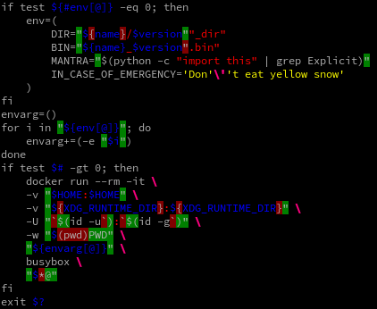

Naziquote
=========

A bash syntax highlighter that encourages (and can fix) proper quoting of variales.

Because rewriting scripts to adhere to the *always use quotes* principle can be daunting:

Above: Selected portions of `xdg-desktop-menu` as highlighted by Naziquote.
The foreground colors are syntax highlighting, whereas the background colors
(green and red) show characters that Naziquote would have added or removed
if let loose with the `--besserwisser` option.
Below: An artificial example that shows more tricky cases and special features.

Why
---

A variable in bash is like a hand grenade – take off its quotes, and it starts ticking. Hence, rule zero of [bash pitfalls][1]: Always use quotes.

Name
----

To be absoultely clear, this is not about nazism.
I mean it in the sense of [an authoritarian, strict or nitpicky person](4):

> (slang, pejorative, offensive) An authoritarian, strict or nitpicky person.

"Nazi" alludes to strict adherence to principles, with little room for excuses.
That's Naziquote in a nutshell:
It *will* break code that relies on unquotedness – because there is no excuse for that!
If the strictest of all shell scripting standards is something you strive for,
Naziquote is the tool for you.

Regrettably, "naziquote" may not be palatable everywhere,
but I couldn't call it "bash cleaner" either, as that means "poo smearer" in Norwegian.

Prior art
---------

* [Shellcheck][2] is a wonderful tool to *detect*, and give general advice, about brittle bash code. The only thing missing is something to say yes with, and *apply* those advice (assuming proper review of course).

* I asked [this SO question][3], for a tool that could rewrite bash scripts with proper quoting. One answerer beat me to it. But if it was me, I would do a syntax highlighter in the same tool (as a way to see if the parser gets lost, and make the most out of the parser, because bash is like quantum mechanics – nobody really knows how it works).

Build
-----

    rustc naziquote.rs

Usage advice
------------

Don't apply `--besserwisser` blindly; code review is still necessary: A script that *relies* on unquoted behavior (implicit word splitting and glob expansion from variables and command substitutions) to work as intended will do none of that after getting the `--besserwisser` treatment!

In that unlucky case, ask yourself whether the script has any business in doing that. All too often, it's just a product of classical shellscripting, and would be better off rewritten, such as by using arrays. Even in the opposite case, say the business logic involves word splitting; that can still be done without invoking globbing. In short: There is always a better way than the forbidden syntax (if not more explicit), but some times, a human must step in to rewrite. See how, in the accompanying [how to do things safely in bash](how_to_do_things_safely_in_bash.md).

[1]: http://mywiki.wooledge.org/BashPitfalls
[2]: https://www.shellcheck.net/
[3]: http://stackoverflow.com/questions/41104131/tool-to-automatically-rewrite-a-bash-script-with-proper-quoting
[4]: https://en.wiktionary.org/wiki/nazi#Dutch
